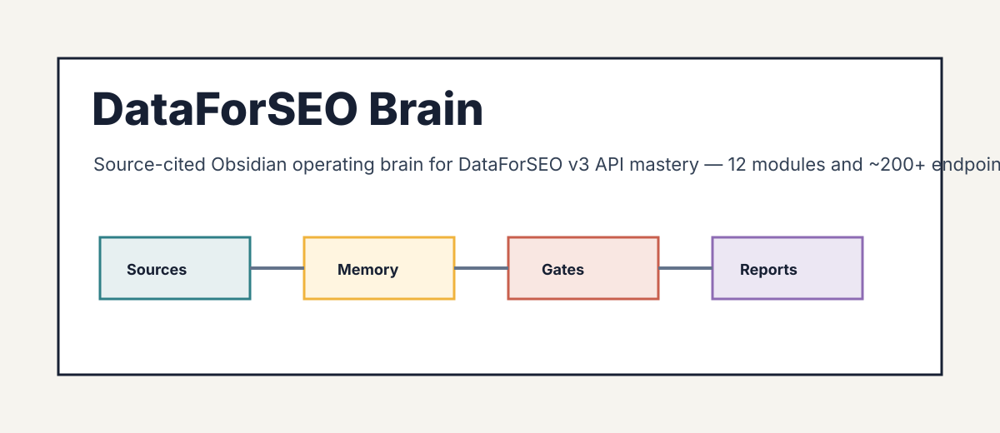

<div align="center">



# DataForSEO Brain

**A source-cited operating memory for the entire DataForSEO v3 API.**

[](LICENSE)
[](wiki/index.md)
[](wiki/concepts/cap-platform-architecture.md)
[](wiki/index.md)
[](references/synthesis/review/wiki-lint-report.md)
[](RELEASE_CHECKLIST.md)
[](references/current-requirements.md)

</div>

> Not a docs mirror and not a tutorial. It is the opinionated layer on top of the DataForSEO API:
> what each of the 12 modules actually does, how the task-vs-live queue and per-call cost model
> really work, which endpoint to reach for which job, and what it costs. Every claim is dated and
> traces to an official source or a live API call.

---

## Why it exists

- **Pick the right call, the first time.** A 12-module, ~200+ endpoint surface is easy to get wrong. The brain routes job to endpoint and flags the cost footguns (Live vs Standard, depth, priority).
- **Current, not stale.** Built from a one-shot scrape, then hardened against the live API and the 2026 changelog (API v2 closure, AI Mode endpoints, MCP 2.9.9, the AI Optimization API).
- **Connected, not flat.** 74 interlinked notes (avg 28 wikilinks each, zero dead links) so you navigate by concept, surface, workflow, and decision, not by scrolling docs.

## Who this is for

- **SaaS builders and in-house engineers** who want raw data at scale and will write code against a REST API.
- **SEO agencies and operators** standardizing on one data provider and needing a cost-control playbook.
- **AI / GEO builders** tracking brand visibility inside ChatGPT, Claude, Gemini, and Perplexity answers.

## Contents

- [What is inside](#what-is-inside)
- [How to use it](#how-to-use-it)
- [The DataForSEO agent surface](#the-dataforseo-agent-surface)
- [How it was built](#how-it-was-built)
- [Quality and verification](#quality-and-verification)
- [Staying current](#staying-current)
- [Repository layout](#repository-layout)
- [Roadmap](#roadmap)
- [Contributing](#contributing)
- [License and author](#license-and-author)

## What is inside

| Layer | Count | What it is |
|---|---|---|
| Concept notes (`wiki/concepts/`) | 31 | Platform mechanics (lifecycle, cost, auth, limits, errors, sandbox, webhooks) plus one capability note per module |
| Platform notes (`wiki/platforms/`) | 10 | Each surface from DataForSEO's lens: Google, Bing, YouTube, Amazon, App Stores, review sites, AI assistants |
| Entity notes (`wiki/entities/`) | 8 | The vendor, the MCP server, competitors (Ahrefs/Semrush/Moz), and upstream data sources |
| Workflow notes (`wiki/flows/`) | 10 | Step-by-step pipelines: rank tracking, keyword research, backlink audit, site audit, local SEO, AI visibility, e-commerce |
| Decision notes (`wiki/decisions/`) | 7 | The judgment spine: which API for which job, live vs standard, MCP vs REST, vs competitors, cost control |
| Research pack (`wiki/sources/`) | 104 citations | Every claim's dated source: official docs plus competitive and GEO research |
| Adapter (`dataforseo_brain/`, `scripts/`) | 1 chain | A response importer, cost synthesizer, and markdown report renderer with passing tests |

**Modules covered:** SERP, Keywords Data, DataForSEO Labs, Backlinks, OnPage, Domain Analytics,
Content Analysis, Merchant, App Data, Business Data, AI Optimization, Databases.

## How to use it

1. **Open the repository root in Obsidian** (File then Open vault then this folder). The graph view is pre-colored by folder.
2. **Start at [`wiki/index.md`](wiki/index.md)**, then the router [`dec-which-api-for-which-job`](wiki/decisions/dec-which-api-for-which-job.md).
3. **Navigate by wikilink.** Good entry points:
   - [`cap-platform-architecture`](wiki/concepts/cap-platform-architecture.md) - the API shape and envelope
   - [`cap-task-vs-live-execution`](wiki/concepts/cap-task-vs-live-execution.md) - the queue vs live model
   - [`dec-cost-control-strategy`](wiki/decisions/dec-cost-control-strategy.md) - how to spend less
   - [`play-cost-optimized-pipeline`](wiki/flows/play-cost-optimized-pipeline.md) - the money-saving reference flow

Prefer the web? The same vault is published as a searchable site (see the repository homepage link).

## The DataForSEO agent surface

The repo ships agent entry points (`SKILL.md`, `AGENTS.md`, `CLAUDE.md`, `GEMINI.md`) so a coding
agent can read the brain first and answer grounded, source-cited questions. The included adapter
normalizes any DataForSEO v3 response into flat records and renders a cost scorecard:

```bash
python scripts/import_dataforseo.py --response tests/fixtures/sample-dataforseo-response.json
python scripts/render_dataforseo_report.py tests/fixtures/sample-dataforseo-response.json
```

## How it was built

An orchestrated, source-cited pipeline (a watcher thread plus parallel secretaries):

1. **Scrape** - 6 parallel agents captured every module's endpoints from `docs.dataforseo.com/v3` (226 unique doc URLs).
2. **Live test** - a cost-governed harness called the production API under a hard budget cap, capturing authentic response fixtures and the real per-call costs.
3. **Research** - fact-checked deep-dives on pricing, the request lifecycle, the competitive landscape, GEO, and the MCP ecosystem.
4. **Synthesize** - capability notes written from the raw docs and research, every claim cited.
5. **Review** - a multi-agent coverage, accuracy, and structure audit with adversarial consolidation, plus a Brainstein SSS+ audit and an Obsidian lint.

## Quality and verification

- **Brainstein maturity: market-ready (anatomy audit SSS+ 100/100)** - all 8 categories full, zero failing items, `--strict` clean.
- **74 notes, avg 82 lines, avg 28 wikilinks, 0 dead links, 0 orphans** (independently lint-verified).
- **Live-verified 2026-06-26** against the production API (43 endpoints exercised; real costs recorded in the cost ledger).
- **Adapter tests green** (importer, synthesis, renderer, malformed-input) plus a deterministic demo vault.
- **Honest gaps documented:** the Backlinks API and AI Optimization LLM Mentions require separate dashboard subscriptions (re-verified 2026-06-26, not removed); those modules are covered from official docs.

## Staying current

The API moves. The brain is re-verified **monthly** for endpoint, parameter, and pricing drift, and
again before every release. Fast-moving facts live in [`references/current-requirements.md`](references/current-requirements.md)
with a `refresh_due` date; the source ledger is [`references/source-ledger.json`](references/source-ledger.json).

## Repository layout

```
DataForSEO Brain/
├── wiki/                  Obsidian vault (the brain): concepts, platforms, entities, flows, decisions, sources
├── dataforseo_brain/      Python package: response adapters (importer, synthesis, renderer)
├── scripts/               CLIs: import, synthesize, render, live test harness
├── schemas/               JSON Schemas (response envelope)
├── tests/                 pytest suite + fixtures (incl. a live response fixture)
├── references/            source-ledger.json, adapter-manifest.json, product-spec, current-requirements
├── examples/sample-vault/ deterministic demo vault
├── site/                  Quartz static-site generator (publishes wiki/ to GitHub Pages)
├── specs/                 the Brainstein spec this brain was generated from
├── SKILL.md, AGENTS.md, CLAUDE.md, GEMINI.md   agent entry points
└── README.md
```

## Roadmap

- Capture live Backlinks and LLM Mentions fixtures once those subscriptions are enabled.
- Add a scheduled monthly drift-check that re-runs the live verification and flags changes.
- Expand the adapter chain with per-module synthesizers (SERP opportunities, backlink toxicity).

## Contributing

See [CONTRIBUTING.md](CONTRIBUTING.md). House rules: every claim carries a dated, trustworthy source;
no credentials in the repo; no em dashes in note bodies; keep wikilinks resolving.

## License and author

Licensed under the terms in [LICENSE](LICENSE). Documentation facts belong to DataForSEO and the cited
publishers; see [NOTICE](NOTICE) and [THIRD_PARTY_NOTICES.md](THIRD_PARTY_NOTICES.md).

Built by **Daniel Agrici** ([@AgriciDaniel](https://github.com/AgriciDaniel)) with Brainstein.
Built and maintained inside the AI Marketing Hub Pro community: https://www.skool.com/ai-marketing-hub-pro
